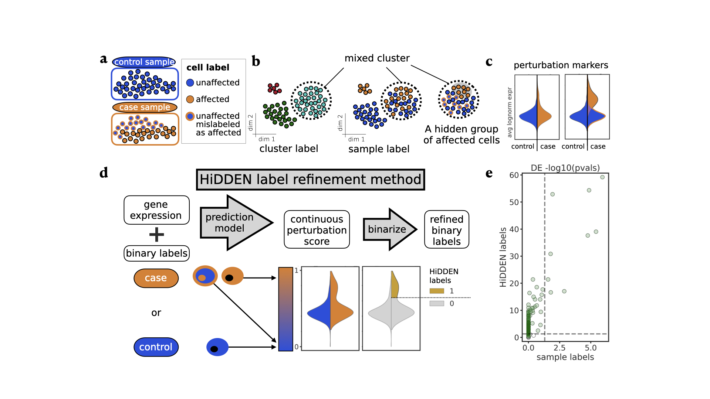

## HiDDEN: A machine learning label refinement method for detection of disease-relevant populations in case-control single-cell transcriptomics

This repo contains:
* 🐍📦 a python **library** *hiddensc* 
* 📍📚 a guided **tutorial** to get you started on identifying subtle changes across conditions in your single-cell data
* 💻📊 all the code neccesary to **reproduce** all analyses and figures in our [preprint](https://www.biorxiv.org/content/10.1101/2023.01.06.523013v1). 

## What is HiDDEN?


In many case-control experiments, only a subset of the cells in case samples are affected by the perturbation (Figure a). The standard analysis workflow of jointly clustering gene expression profiles of case and control cells can fail to distinguish affected from unaffected cells, resulting in mixed clusters (Figure b) due to multiple sources of variance competing with the perturbation signal. Differential expression using the sample-level labels within a mixed cluster can fail to recover the perturbation markers due to the incorrect labels decreasing detection power (Figure c). 

Here we introduce HiDDEN, a novel machine learning method which refines the labels of individual cells within perturbation conditions to accurately reflect their status as affected or unaffected. The standard analysis of single cell data is not tailored to identifying perturbation-associated signals. However, combining gene expression profiles and sample-level labels in a novel way allows us to leverage that at least some of the labels are correct and empowers HiDDEN to utilize the shared variability in features corresponding to correctly labeled cells.

HiDDEN transforms the sample-level labels into cell-specific continuous perturbation-effect scores and assigns new binary cell labels, revealing their status as affected or unaffected (Figure d). The resulting binary labels can accurately capture the perturbation signature and boost power to detect genes whose expression is affected by the perturbation (Figure e).

## How to install and use
All required python dependencies can be found in enviroment.yml and can be installed with the following command:
```
conda env create --file environment.yml
```

## What's in the Repo?

- **data** : Input files (*.csv, *.h5da, *.npz), larger files are compressed
  - uncompress_data.sh : bash script to decompress files,
  - compress_data.sh : bash script to compress files.
- **hiddensc** : Library for running hidden.
- **scripts** : Single use scripts for generating features, predictions and performance metrics.
- **figures** : Input and output files.
- **notebooks** : Scripts and notebooks to reproduce figure analysis.
- **media** : Images for github README.

## Giving Credit
If you use this code in your work, we ask that you cite our work. Here is an example BibTex entry:

```
@article{Goeva2023,
  doi = {10.1101/2023.01.06.523013},
  url = {https://doi.org/10.1101/2023.01.06.523013},
  year = {2023},
  month = jan,
  publisher = {Cold Spring Harbor Laboratory},
  author = {Aleksandrina Goeva and Michael-John Dolan and Judy Luu and Eric Garcia and Rebecca Boiarsky and Rajat M Gupta and Evan Macosko},
  title = {{HiDDEN}: A machine learning label refinement method for detection of disease-relevant populations in case-control single-cell transcriptomics}
}
```


